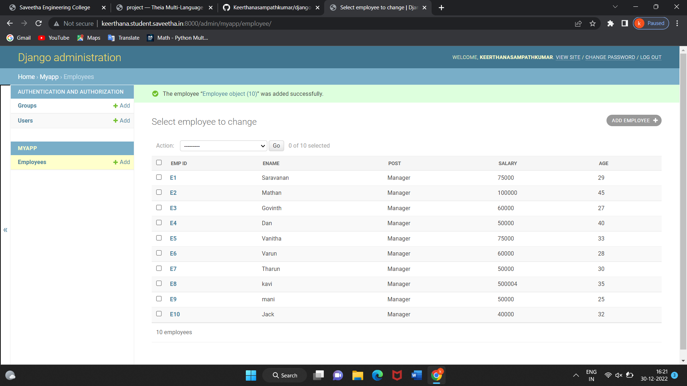
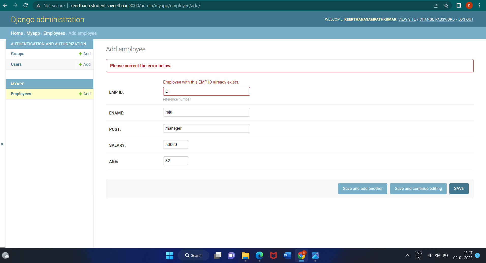

# Django ORM Web Application

## AIM
To develop a Django application to store and retrieve data from a database using Object Relational Mapping(ORM).

## Entity Relationship Diagram


## DESIGN STEPS

### STEP 1:
Create a new Django project using "django-admin startproject", get into the project
terminal and use "python3 manage.py startapp"command.

### STEP 2:
Define a model for the Employee Table in the models.py. Allow host access and add
the app name under installed apps in settings.py

### STEP 3:
Register the models with the Django admin site. In admin.py under app folder,
register the models with Django admin site.

### STEP 4:
Run the python manage.py makemigrations and python manage.py migrate
commands to create the necessary database tables for the Employee Table model.
Run the server using "python3 manage.py runserver 0:80" command


## PROGRAM
```
# models.py

from django.db import models

from django.contrib import admin

# Create your models here.

from django.db import models
from django.contrib import admin
# Create your models here.
class Employee(models.Model):
    EMP_ID=models.CharField(primary_key=True,max_length=20,help_text="reference number")
    ENAME=models.CharField(max_length=100)
    POST=models.CharField(max_length=100)
    SALARY=models.IntegerField()
    AGE=models.IntegerField(null=32)

class EmployeeAdmin(admin.ModelAdmin):
    list_display=('EMP_ID','ENAME','POST','SALARY','AGE')

# admin.py

from django.contrib import admin
from .models import Employee,EmployeeAdmin

# Register your models here.
admin.site.register(Employee,EmployeeAdmin)

```
## OUTPUT

### Admin page


### Primary key confirmation


## RESULT
Django application to store and retrieve data from a database using Object Relational Mapping(ORM) is created successfully